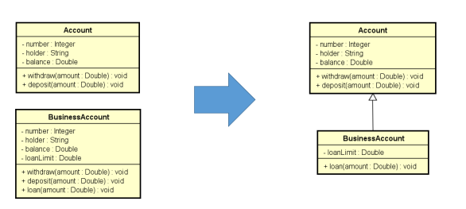
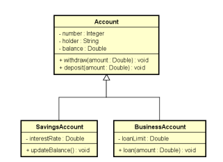
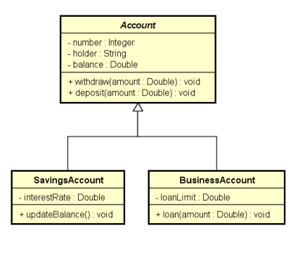

# About the project
:warning: This repo it's just for study purposes.

### :triangular_flag_on_post: Subjectives
:purple_circle: Inheritance <br>
:purple_circle: Downcasting <br>
:purple_circle: Upcasting <br>
:purple_circle: Abstraction

### :triangular_flag_on_post: Understanding comments
Everytime you see a code commented between 
``` /* text */ ``` means an explanation to some piece of code
or to the subject that I've learned, it's for me to remember.
<br> When you see a code commented in this way, 
`` // code `` it's a piece of code that I commented because 
I'm not using it anymore, but I want in there to know how it 
works. <br>
It's important for you to know that this repository have subjects
from a series of classes, this is why I have a lot of code commented.
Only for study and practice purposes.

## :balloon: Repository content :balloon:

### :sparkles: Inheritance
In inheritance I've learned the advantages to use and how. <br>

**The model implemented:** <br>


### :sparkles: Upcasting and Downcasting
:magic_wand: **Upcasting:** <br> 
**Common use:** Polymorphism. <br>
It's a casting of subclass to superclass

:magic_wand: **Downcasting:** <br>
**Common use:** Methods that receive generics parameters.<br>
It's a casting of superclass to subclass. <br>
You have to use the key ``instanceof`` <br>

**The model implemented:** <br>


### :sparkles: Abstraction
Can't be instantiated.
Way to guarantee full inheritance. 

**The model implemented:** <br>
